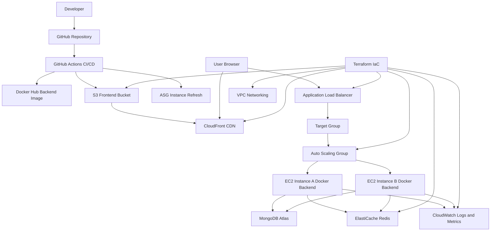

# StartTech Assessment 3 Architecture

## Overview

This project implements a production-style CI/CD and cloud infrastructure setup for the StartTech full-stack application.

The architecture includes:

- React frontend hosted on Amazon S3
- CloudFront distribution for global frontend delivery
- Golang backend API deployed on EC2 instances
- Application Load Balancer for backend traffic routing
- Auto Scaling Group for backend high availability
- Dockerized backend deployment
- MongoDB Atlas for database persistence
- ElastiCache Redis for caching/session layer
- CloudWatch for logs, metrics, dashboard, and alarms
- Terraform for infrastructure provisioning
- GitHub Actions for CI/CD automation

## Architecture Diagram

## Infrastructure Components

### Networking

The network layer contains:

- Custom VPC
- Public subnets
- Private subnets
- Internet Gateway
- NAT Gateway
- Route tables
- Security groups

### Frontend Hosting

The frontend is hosted using:

- Amazon S3 static website hosting
- CloudFront CDN distribution
- GitHub Actions frontend deployment workflow

### Backend Hosting

The backend API is deployed using:

- Docker container image
- EC2 instances
- Auto Scaling Group
- Launch Template
- Application Load Balancer
- Target Group health checks

### Database

MongoDB Atlas is used as the database layer.

The backend connects to MongoDB using environment variables passed into the Docker container.

### Redis

ElastiCache Redis is provisioned as the caching/session layer.

### Monitoring

Monitoring includes:

- CloudWatch Log Groups
- CloudWatch Dashboard
- CloudWatch CPU alarm
- Auto Scaling policy triggered by CPU utilization

## Backend Traffic Flow

1. User sends request to ALB DNS.
2. ALB forwards request to the backend target group.
3. Target group routes traffic to healthy EC2 instances.
4. EC2 instances run the backend Docker container on port 8080.
5. Backend connects to MongoDB Atlas.
6. Health checks are performed using `/health`.

## CI/CD Flow

### Backend

1. Code is pushed to `main`.
2. GitHub Actions runs tests.
3. Docker image is built.
4. Docker image is pushed to Docker Hub.
5. AWS credentials are configured.
6. Auto Scaling Group instance refresh is triggered.
7. New EC2 instances pull the latest Docker image during boot.
8. Old instances are drained and replaced.

### Frontend

1. Code is pushed to `main`.
2. GitHub Actions installs dependencies.
3. React app is built.
4. Build output is synced to S3.
5. CloudFront cache is invalidated.

## High Availability

High availability is provided through:

- Multiple EC2 instances
- Auto Scaling Group
- Multi-AZ public subnets
- Application Load Balancer
- Target group health checks
- Instance refresh rolling deployment

## Security

Security practices include:

- IAM role attached to EC2 instances
- Security groups for traffic control
- GitHub Secrets for CI/CD credentials
- Environment variables for application configuration
- MongoDB Atlas network access control